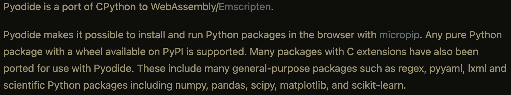
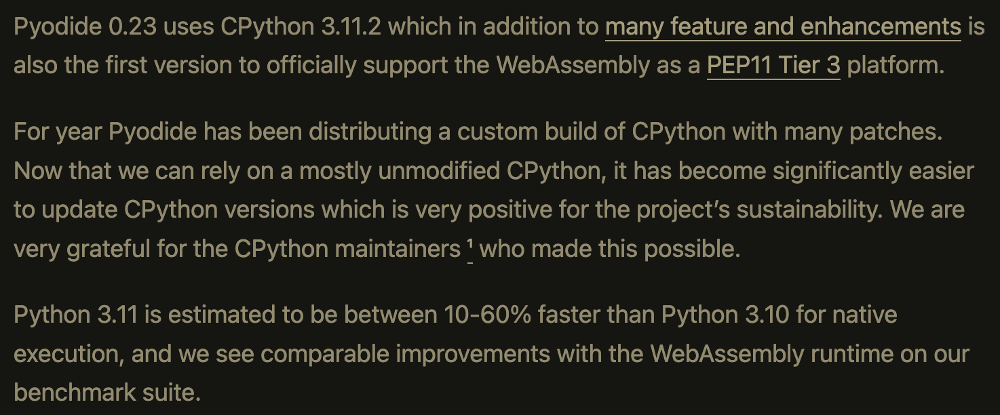
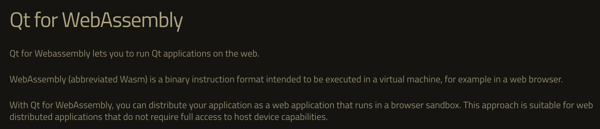

-
- TODO Generate [[SRS presentation]] or [[SRS web page]] with [Gamma](https://gamma.app) #Gamma
- Activate *prefer pasting file* in Logseq settings/editor to paste screenshots
- Generate Anki cards with [genanki_rs](https://docs.rs/genanki-rs/0.3.1/genanki_rs/index.html) #content
- [[Anki development]] resources  #Python_for_Anki
	- [Official Anki Build instructions] (https://github.com/ankitects/anki/blob/main/docs/development.md)
	- [PySide](https://en.wikipedia.org/wiki/PySide) is QT's Python binding but [WebAssembly support](https://bugreports.qt.io/browse/PYSIDE-962) falls short of [Pyodide](https://pyodide.org/en/stable/index.html)'s. See [QT's Python development notes](https://wiki.qt.io/Qt_for_Python_Development_Notes_2022)
		-
		- 
		-
	- [Pyodide now officially supports WebAssembly](https://blog.pyodide.org/posts/0.23-release/)
		- 
	- [QT for WebAssembly](https://doc.qt.io/qt-6/wasm.html)
		- 