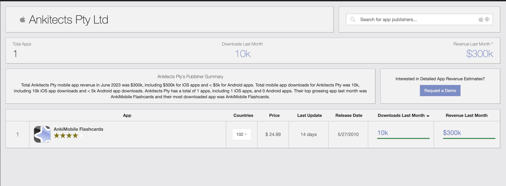
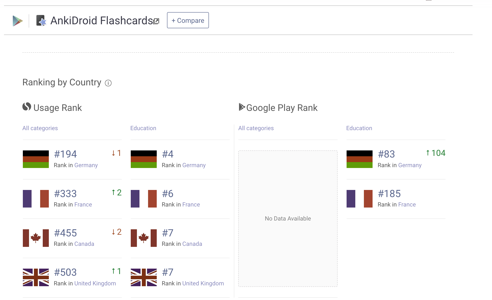
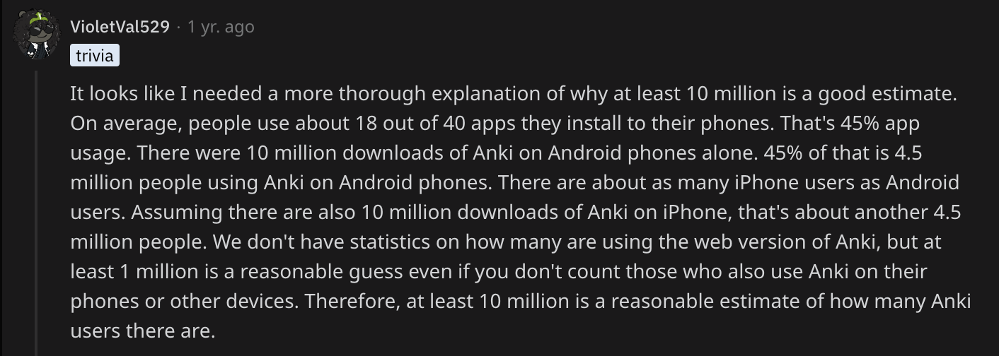
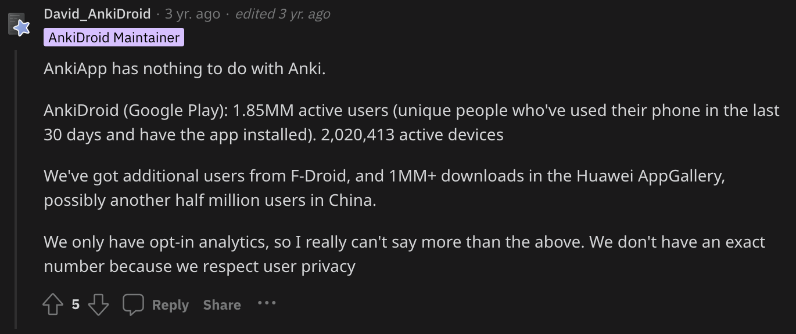

- Ankimobile download and revenue statistics #Ankitects
	- [Statistics from here](https://app.sensortower.com/ios/publisher/publisher/373493390)
	- 
	- Estimate that around 10k new Ankimobile customers who pay $25 per shot are joining every month and that Ankidroid and Anki Desktop downloads are somewhat compatible, then ball park +/- 360,000 new users per year. Even on the assumption that not everyone who downloads actually practices, still we have an estimated picture.
	- {:height 465, :width 749}
		- [From this Reddit thread](https://www.reddit.com/r/Anki/comments/vbg924/how_many_anki_users_are_there/)
	- 
	- [Another good Anki downloads and users thread](https://www.reddit.com/r/Anki/comments/l6srk3/how_many_ankiusers/)
	- 
	-